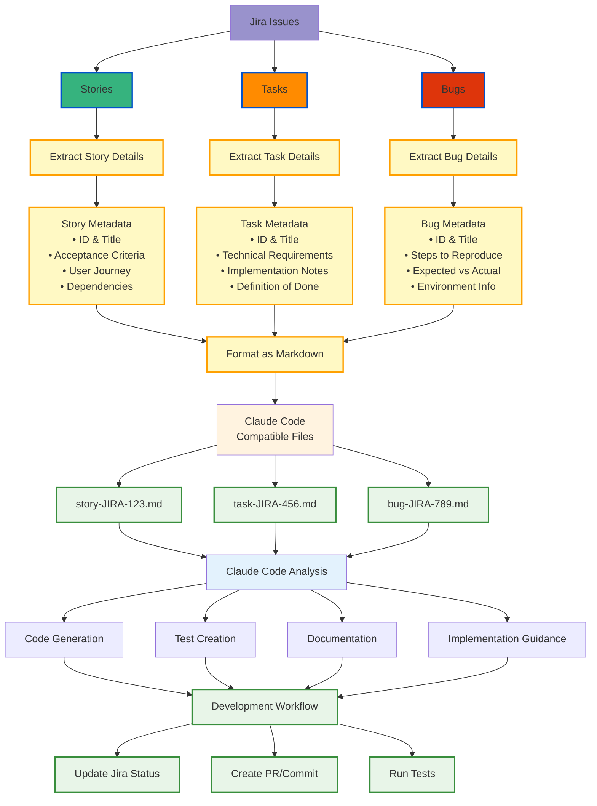

# Jira to Claude Code Workflow

This diagram shows how to convert Jira issues (stories, tasks, and bugs) into markdown files that Claude Code can consume for development assistance.



## Conversion Process

### 1. Issue Extraction
- **Stories**: Focus on user value, acceptance criteria, and business context
- **Tasks**: Extract technical requirements and implementation details  
- **Bugs**: Capture reproduction steps, expected behavior, and environment

### 2. Markdown Template Structure

#### Story Template (`story-JIRA-123.md`)
```markdown
# Story: [JIRA-123] Title

## User Story
As a [user type], I want [goal] so that [benefit].

## Acceptance Criteria
- [ ] Criterion 1
- [ ] Criterion 2

## Dependencies
- Related issues
- Prerequisites

## Notes
Additional context from Jira
```

#### Task Template (`task-JIRA-456.md`)
```markdown
# Task: [JIRA-456] Title

## Objective
Technical goal and purpose

## Requirements
- Technical specifications
- Performance criteria
- Security considerations

## Definition of Done
- [ ] Code implemented
- [ ] Tests written
- [ ] Documentation updated
```

#### Bug Template (`bug-JIRA-789.md`)
```markdown
# Bug: [JIRA-789] Title

## Description
Issue summary

## Steps to Reproduce
1. Step one
2. Step two

## Expected Behavior
What should happen

## Actual Behavior
What actually happens

## Environment
- OS, browser, version info
```

### 3. Claude Code Integration
These markdown files serve as context for Claude Code to:
- Understand requirements and constraints
- Generate appropriate code solutions
- Create relevant tests
- Provide implementation guidance
- Update issue status upon completion
