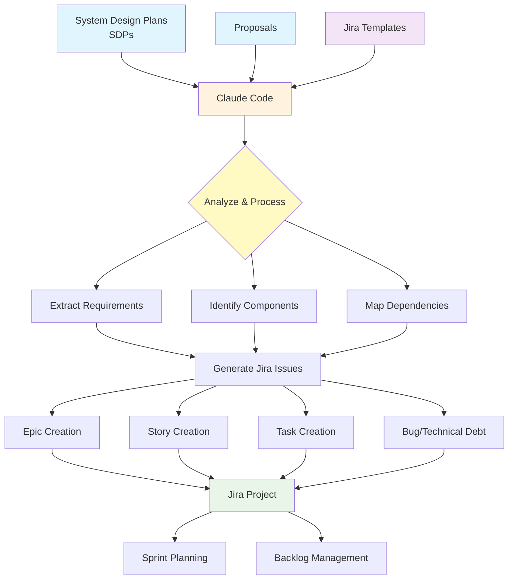

# Jira Issue Creation Workflow

This diagram shows the workflow of using System Design Plans (SDPs) and Proposals with Claude Code and Jira templates to create Jira issues.

## Workflow Steps

1. **Input Sources**: System Design Plans (SDPs) and Proposals provide the technical requirements and business context
2. **Processing**: Claude Code analyzes the input documents along with predefined Jira templates
3. **Analysis Phase**: 
   - Extract functional and non-functional requirements
   - Identify system components and modules
   - Map dependencies and integration points
4. **Issue Generation**: Create appropriate Jira issues based on the analysis:
   - **Epics**: High-level features or initiatives
   - **Stories**: User-facing functionality
   - **Tasks**: Technical implementation work
   - **Bugs/Technical Debt**: Known issues or improvements
5. **Output**: Structured Jira issues ready for sprint planning and backlog management